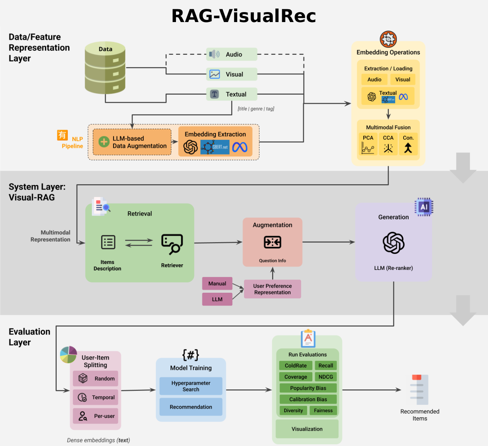

# 🏠 RAG-VisualRec

This repository contains a resource of an open resource for **vision and text-enhanced Retrieval-Augmented Generation (RAG)** in the recommendation domain. **RAG-VisualRec** provides a new, reproducible test‑bed for multimodal RAG research. It is designed as a transparent, modular, and extensible resource for rigorous multimodal recommendation research, with a primary goal of bridging the gap between theoretical advances (e.g., fusion techniques, textual data augmentation, multi-modal retrieval, augmented generation) and practical, reproducible workflows that any researcher can adapt or extend.



## 🧠 Architecture

The overall pipeline of **RAG-VisualRec** contains below steps:

- Data preparation and Ingestion, starting with MovieLens (`latest-small` and `1M`) dataset
- Multimodal embedding extraction (including textual, visual, and audio)
- Applying fusion strategies (e.g., concatenation, PCA, CCA)
- Applying user embedding construction (random, averag, or temporal)
- Candidate retrieval
- Profile augmentation and LLM prompting (manual or LLM-based)
- Evaluation and logging (accuracy, beyond-accuracy, fairness/robustness)


## 🚀 Getting Started

The whole framework is fully configurable through a centralized parameter block in the **Google Colab** notebook. Check the [`codes`](/codes/README.md) directory for more information.

## 📚 Citation

This research is submitted to [ACM Transactions on Recommender Systems](https://dl.acm.org/journal/tors).

```bibtex
@article{tourani2025rag,
  title={RAG-VisualRec: An Open Resource for Vision-and Text-Enhanced Retrieval-Augmented Generation in Recommendation},
  author={Tourani, Ali and Nazary, Fatemeh and Deldjoo, Yashar},
  journal={arXiv preprint arXiv:2506.20817},
  year={2025}
  doi={https://doi.org/10.48550/arXiv.2506.20817}
}
```

## 📎 Related Repositories

- 🔨 [ViLLA-MMBench: Multimodal Recommender](https://github.com/RecSys-lab/ViLLA-MMBench)
- 🎞️ [MoViFex: Movie Recommendation Framework](https://github.com/RecSys-lab/MoViFex)

## 🔑 License

This project is licensed under the GPL-3.0 license - see the [LICENSE](/LICENSE) for more details.

## 📬 Contact

If you have any questions or collaboration opportunities, please open an issue or contact the authors.