# 👣 Pipeline Walkthrough

```mermaid
flowchart TD
    A[📂 Data Preparation<br/>Load MovieLens + Metadata] --> B[🧩 Embedding Extraction<br/>Text • Visual • Audio]
    B --> C[🔀 Fusion<br/>Concat • PCA • CCA • Avg]
    C --> D[👤 User Embedding<br/>Random • Average • Temporal]
    D --> E[🔎 Candidate Retrieval<br/>kNN Top-N Search]
    E --> F[📝 Profile Augmentation<br/>Manual or LLM-based]
    F --> G[🤖 LLM Re-ranking<br/>ID-only or Explainable]
    G --> H[📊 Evaluation & Logging<br/>Accuracy • Diversity • Fairness]

    style A fill:#f9f9f9,stroke:#333,stroke-width:1px
    style B fill:#e6f0ff,stroke:#333,stroke-width:1px
    style C fill:#e6f0ff,stroke:#333,stroke-width:1px
    style D fill:#fff2cc,stroke:#333,stroke-width:1px
    style E fill:#fff2cc,stroke:#333,stroke-width:1px
    style F fill:#f2e6ff,stroke:#333,stroke-width:1px
    style G fill:#f2e6ff,stroke:#333,stroke-width:1px
    style H fill:#d9ead3,stroke:#333,stroke-width:1px
```



## 1️⃣ Data Preparation and Ingestion

We start by loading data from **MovieLens (small or 1M)**.

* User–item interactions are cleaned and indexed.
* Metadata like **title, genres, and tags** is merged in.
* Missing information is handled smoothly (important for cold-start or incomplete data).

👉 Example:

* **Input**: `Nixon (1995)` → Genres: *Drama, Biography* → Description: *(missing)*
* **Output (after LLM enrichment)**:
  *“Nixon (1995) explores the troubled psyche and political career of America's 37th president...”*

We also tag each movie by **popularity**:

* **Head** (top 10%)
* **Mid-tail** (next 40%)
* **Long-tail** (bottom 50%)

---

## 2️⃣ Multimodal Embedding Extraction

For each item, we generate embeddings (vector representations) from different sources:

* **Text** → From movie descriptions using models like OpenAI Ada, MiniLM, or LLaMA.
* **Visual** → From trailer/keyframes using ResNet-50 (2048-dim vectors).
* **Audio (optional)** → Extract MFCC features (128-dim).
* **Fusion** → Combine modalities using methods like:

  * Concat (stack vectors)
  * PCA (reduce to 128-dim)
  * CCA (align text & visual spaces)
  * Avg (simple average)

👉 Example:

* Text embedding: `[... -0.31, 0.54, 1.02 ...]`
* Visual embedding: `[... 0.11, -0.22, 0.91 ...]`
* CCA fusion → joint 64-dim vector: `[... 0.44, 0.08, -0.32 ...]`

---

## 3️⃣ Embedding Swap & Re-embedding

If movie info changes (e.g., after augmentation), we re-run the embedding step.
✅ Ensures all experiments always use **up-to-date representations**.

---

## 4️⃣ User Embedding Construction

We create user profiles in the same space as items. Options:

* **Random** → sanity check baseline.
* **Average** → mean of all liked items.
* **Temporal** → recent interactions get more weight.

👉 Example:
User 42 watched *Nixon (1995)*, *The Post*, *Frost/Nixon*.

* More recent movies (e.g., *The Post*) count more in their profile.

---

## 5️⃣ Candidate Retrieval

With user embeddings ready:

* We build a **kNN index** of all items.
* For each user → find **top-N most similar items**.

This step reflects all upstream choices (embedding model, fusion method, user strategy).

---

## 6️⃣ Profile Augmentation & LLM Prompting

We enhance user profiles with structured info:

* **Manual**: Extracted from history (genres, top movies, tags).
* **LLM-based**: Generated with a short natural-language summary.

👉 Example Profile:

```json
{
  "Genres": ["Drama", "Biography"],
  "Top items": ["Nixon (1995)", "The Post"],
  "Taste": "Prefers political dramas exploring real historical events."
}
```

This profile + candidate movies → passed to the LLM with instructions.

---

## 7️⃣ LLM Re-ranking

The LLM receives:

1. User profile
2. Candidate movies
3. Instructions

It outputs a ranked list.

* **ID-only mode** → Just movie IDs (privacy-friendly).
* **Explainable mode** → IDs + reasoning.

If parsing fails → fallback to kNN list.

---

## 8️⃣ Evaluation & Logging

Every run is measured using:

* **Accuracy** → Recall\@K, nDCG\@K, MAP, MRR.
* **Beyond-accuracy** → Coverage, novelty, diversity, long-tail %.
* **Fairness/robustness** → Cold-start, exposure balance.

Results are logged per user, averaged, and exported (CSV/Parquet).
✅ Intermediate artifacts (embeddings, candidates, logs) are checkpointed for reproducibility.